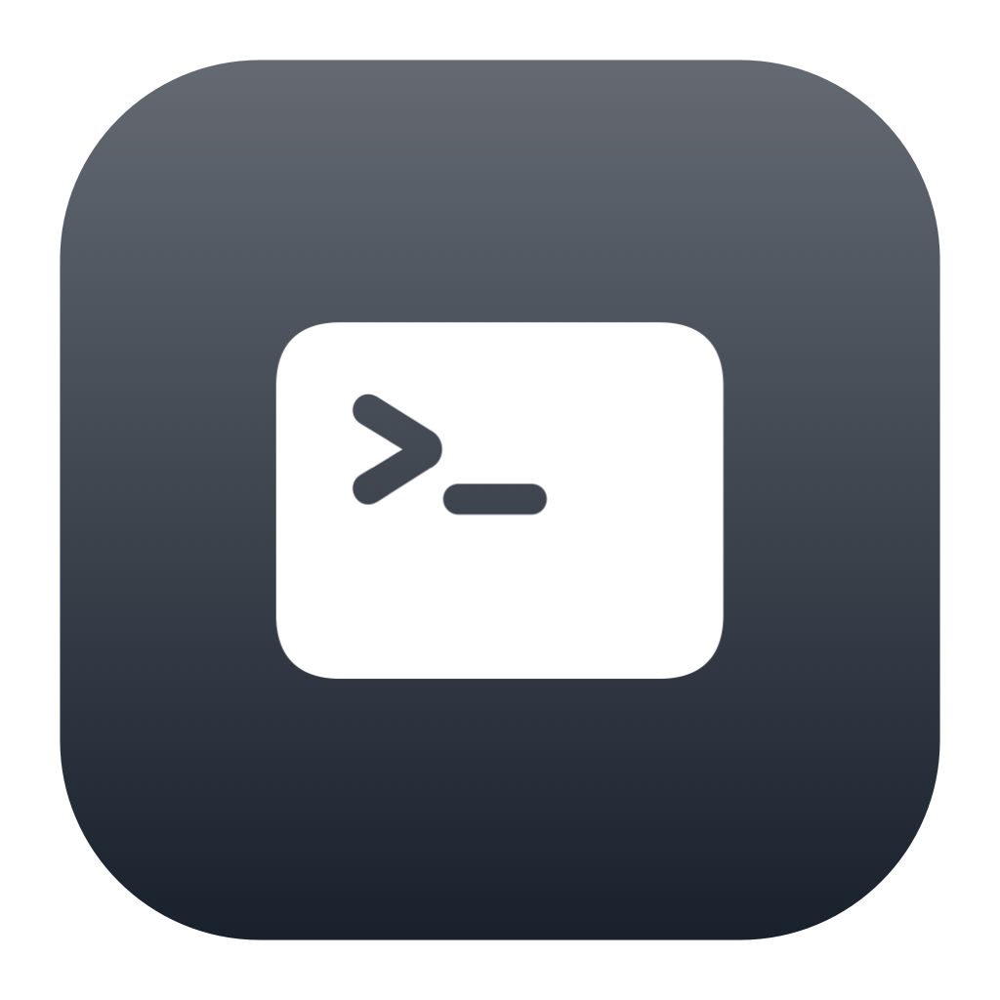
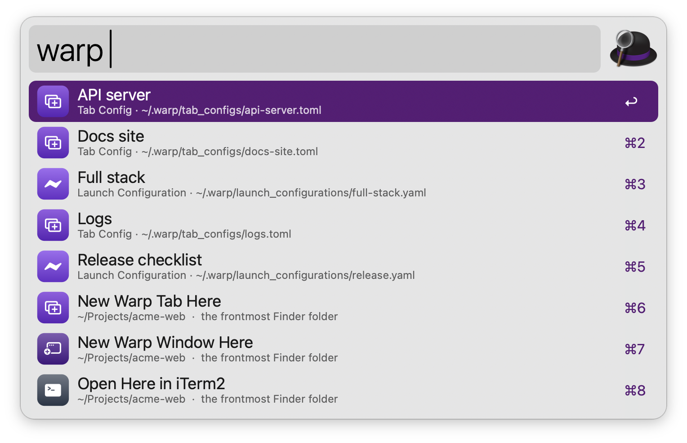
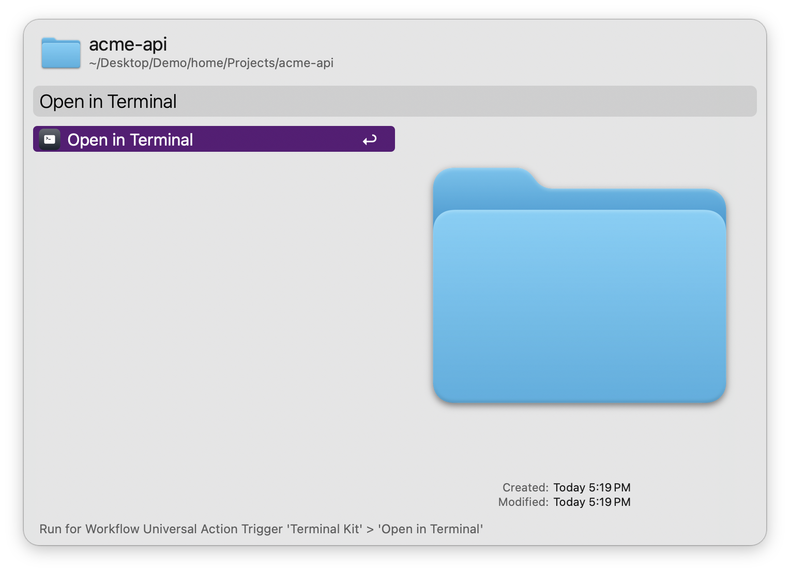
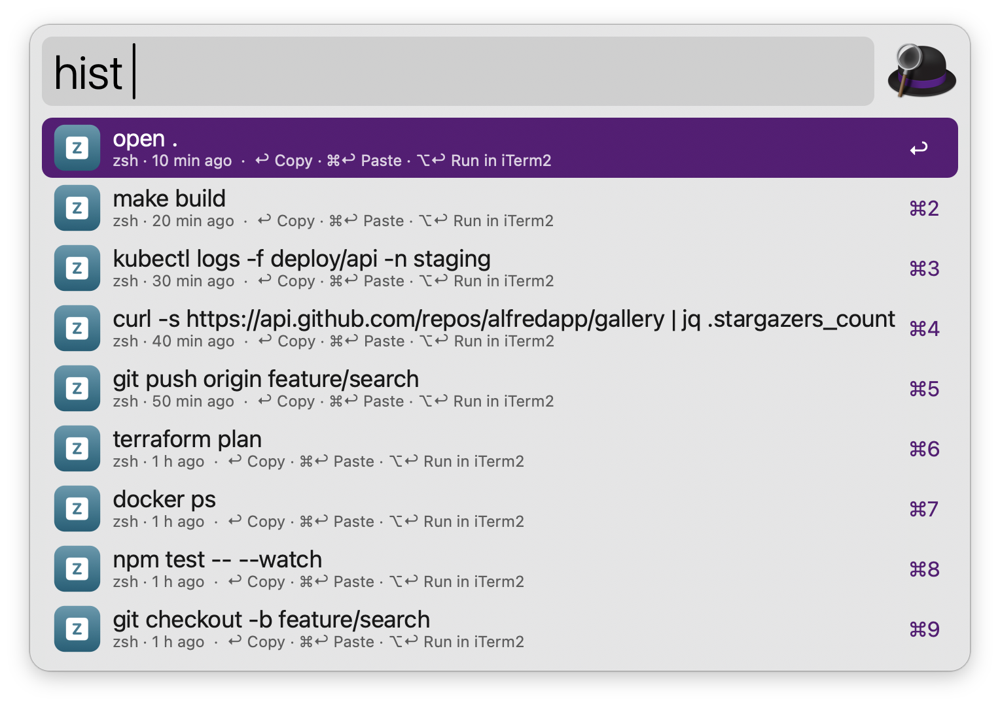
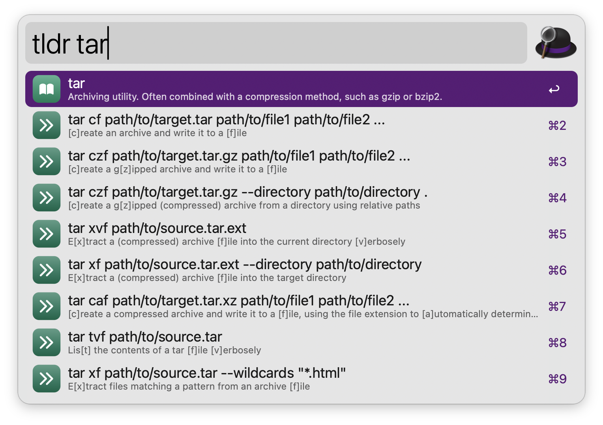
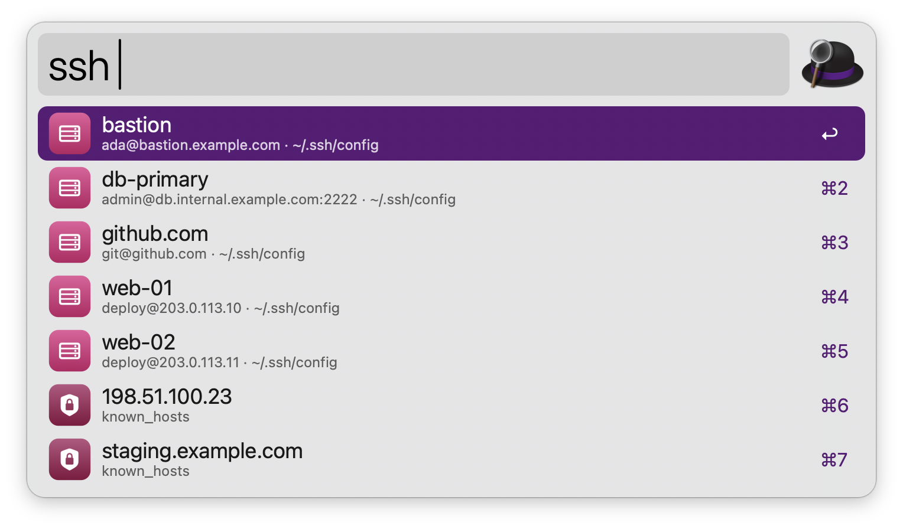

#  Terminal Kit

Open Warp launch configurations, search your shell history, read tldr pages offline and connect to SSH hosts, in the terminal you prefer. No dependencies: everything runs on tools that ship with macOS.

## Usage

Open a Warp Tab Config or Launch Configuration via the `warp` keyword. The list also opens a new Warp tab or window in the frontmost Finder folder, or the folder in your preferred terminal.



* <kbd>↩</kbd> Open the configuration.
* <kbd>⌘</kbd><kbd>↩</kbd> Reveal the file in Finder.
* <kbd>⌥</kbd><kbd>↩</kbd> Edit the file.
* <kbd>⌃</kbd><kbd>↩</kbd> Open a Tab Config in a new window.

Alternatively, open folders in your preferred terminal via the Universal Action.



### Shell History

Search the history of zsh, bash, fish and atuin via the `hist` keyword. Commands are newest first, without duplicates, and show when they ran if the shell saved the time. Words can come in any order, and letters that skip ahead (`kgp` for `kubectl get pods`) also match.



* <kbd>↩</kbd> Copy the command.
* <kbd>⌘</kbd><kbd>↩</kbd> Paste the command into the frontmost app.
* <kbd>⌥</kbd><kbd>↩</kbd> Run the command in your preferred terminal.

### tldr Pages

Read practical examples for a command, like `tldr tar`, via the `tldr` keyword. Pages are downloaded once (about 3 MB) and refresh weekly in the background, so they work offline. Add words to filter the examples (`tldr git stash apply`), or type part of a name to find pages.



* <kbd>↩</kbd> Copy the example, with the placeholders as plain text.
* <kbd>⌘</kbd><kbd>↩</kbd> Paste the example into the frontmost app.
* <kbd>⌥</kbd><kbd>↩</kbd> Copy the example with its `{{placeholders}}`.

When there’s no page, look the command up on cheat.sh (online) by adding `@cheat`, like `tldr jq @cheat`.

### SSH

Connect to hosts from `~/.ssh/config` (including `Include` files) and `~/.ssh/known_hosts` via the `ssh` keyword. Type `user@host` or `host:port` to connect somewhere new.



* <kbd>↩</kbd> Connect in your preferred terminal.
* <kbd>⌘</kbd><kbd>↩</kbd> Copy the `ssh` command.
* <kbd>⌥</kbd><kbd>↩</kbd> Open the file that defines the host.

### Terminals

Choose Terminal, iTerm2, Ghostty, Warp, kitty, WezTerm or Alacritty in the Workflow’s Configuration, or leave it on Automatic to use the first one installed. Commands are typed into a new window (or a tab, for iTerm2, Ghostty and Warp). Warp runs the command from a temporary Tab Config, which is deleted a minute later. Warp versions older than May 2026 can’t do that, so Terminal Kit pastes the command into a new Warp tab instead: Alfred needs Accessibility access for that. Ghostty 1.3 or newer is controlled through AppleScript; older versions start a new window that runs the command.

Every keyword can be changed in the Workflow’s Configuration.

## Development

```bash
swift tools/make_icons.swift tools/icons.json src   # regenerate icons
python3 tools/build.py --package                     # write src/info.plist and dist/*.alfredworkflow
python3 tests/test_terminal_kit.py                   # run the tests
```

## AI disclosure

This workflow was developed with the help of Claude (Anthropic), an AI assistant. The code is reviewed and tested by the author.
